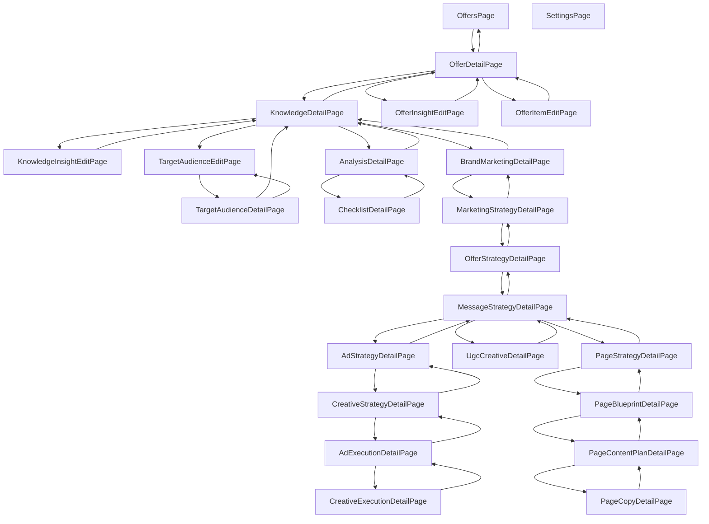

# Mapa stron aplikacji (ai-ec-agent frontend)

Wygenerowano: 2026-08-06
Źródło: `frontend/src/App.tsx` (router) oraz `frontend/src/pages/*.tsx`

Wszystkie strony są opakowane wspólnym layoutem `AppShell` (`frontend/src/components/AppShell.tsx`).
Większość stron detali korzysta ze wspólnego `DetailShell` (link "wstecz" = `backTo`) oraz `ResourceList`
(linki do dzieci = `linkTo`) — dlatego nawigacja jest w dużej mierze zdefiniowana przez te dwa komponenty,
a nie bezpośrednie `<Link>`/`navigate()` w każdej stronie.

## Lista stron

| Strona | Trasa (route) | Plik |
|---|---|---|
| OffersPage | `/` | pages/OffersPage.tsx |
| OfferDetailPage | `/offers/:offerId` | pages/OfferDetailPage.tsx |
| KnowledgeDetailPage | `/knowledges/:knowledgeId` | pages/KnowledgeDetailPage.tsx |
| TargetAudienceDetailPage | `/target-audiences/:id` | pages/TargetAudienceDetailPage.tsx |
| TargetAudienceEditPage | `/target-audiences/:id/edit` | pages/TargetAudienceEditPage.tsx |
| OfferInsightEditPage | `/offer-insights/:id/edit` | pages/OfferInsightEditPage.tsx |
| OfferItemEditPage | `/offer-items/:id/edit` | pages/OfferItemEditPage.tsx |
| KnowledgeInsightEditPage | `/knowledge-insights/:id/edit` | pages/KnowledgeInsightEditPage.tsx |
| AnalysisDetailPage | `/knowledges/:knowledgeId/analysis/:analysisId` | pages/AnalysisDetailPage.tsx |
| ChecklistDetailPage | `/knowledges/:knowledgeId/analysis/:analysisId/checklists/:checklistId` | pages/ChecklistDetailPage.tsx |
| BrandMarketingDetailPage | `/brand-marketing/:id` | pages/BrandMarketingDetailPage.tsx |
| MarketingStrategyDetailPage | `/marketing-strategy/:id` | pages/MarketingStrategyDetailPage.tsx |
| OfferStrategyDetailPage | `/offer-strategy/:id` | pages/OfferStrategyDetailPage.tsx |
| MessageStrategyDetailPage | `/message-strategy/:id` | pages/MessageStrategyDetailPage.tsx |
| AdStrategyDetailPage | `/ad-strategy/:id` | pages/AdStrategyDetailPage.tsx |
| CreativeStrategyDetailPage | `/creative-strategy/:id` | pages/CreativeStrategyDetailPage.tsx |
| AdExecutionDetailPage | `/ad-execution/:id` | pages/AdExecutionDetailPage.tsx |
| CreativeExecutionDetailPage | `/creative-execution/:id` | pages/CreativeExecutionDetailPage.tsx |
| UgcCreativeDetailPage | `/ugc-creatives/:id` | pages/UgcCreativeDetailPage.tsx |
| PageStrategyDetailPage | `/page-strategy/:id` | pages/PageStrategyDetailPage.tsx |
| PageBlueprintDetailPage | `/page-blueprint/:id` | pages/PageBlueprintDetailPage.tsx |
| PageContentPlanDetailPage | `/page-content-plan/:id` | pages/PageContentPlanDetailPage.tsx |
| PageCopyDetailPage | `/page-copy/:id` | pages/PageCopyDetailPage.tsx |
| SettingsPage | `/settings` | pages/SettingsPage.tsx |

## Zależności per strona

- **OffersPage** (`/`) — strona główna (lista ofert). Punkt wejścia z sidebaru.
  - → OfferDetailPage (kliknięcie oferty)

- **OfferDetailPage** (`/offers/:offerId`) — wymaga `offerId` z OffersPage.
  - → OffersPage (backTo, oraz redirect po usunięciu oferty)
  - → KnowledgeDetailPage, OfferInsightEditPage, OfferItemEditPage

- **KnowledgeDetailPage** (`/knowledges/:knowledgeId`) — `knowledgeId` z listy w OfferDetailPage.
  - → OfferDetailPage (backTo)
  - → KnowledgeInsightEditPage, TargetAudienceEditPage (bezpośrednio do edycji, nie przez Detail), AnalysisDetailPage, BrandMarketingDetailPage

- **TargetAudienceDetailPage** (`/target-audiences/:id`) — strona "osierocona": brak linku wejściowego z KnowledgeDetailPage (tam link prowadzi wprost do edycji); osiągalna tylko jako cel `navigate()` z TargetAudienceEditPage.
  - → KnowledgeDetailPage (backTo), TargetAudienceEditPage

- **TargetAudienceEditPage** (`/target-audiences/:id/edit`) — `id` z KnowledgeDetailPage.
  - → TargetAudienceDetailPage (po zapisie/anulowaniu)

- **OfferInsightEditPage** (`/offer-insights/:id/edit`) — `id` z OfferDetailPage.
  - → OfferDetailPage (po zapisie/anulowaniu, na podstawie `data.offer_id`)

- **OfferItemEditPage** (`/offer-items/:id/edit`) — `id` z OfferDetailPage.
  - → OfferDetailPage (po zapisie/anulowaniu)

- **KnowledgeInsightEditPage** (`/knowledge-insights/:id/edit`) — `id` z KnowledgeDetailPage.
  - → KnowledgeDetailPage (po zapisie/anulowaniu)

- **AnalysisDetailPage** (`/knowledges/:knowledgeId/analysis/:analysisId`) — z listy Analiz w KnowledgeDetailPage.
  - → KnowledgeDetailPage (backTo), ChecklistDetailPage

- **ChecklistDetailPage** (.../checklists/:checklistId) — z listy Checklist w AnalysisDetailPage. Liść (brak dalszych stron).
  - → AnalysisDetailPage (backTo)

- **BrandMarketingDetailPage** (`/brand-marketing/:id`) — z listy Brand marketing w KnowledgeDetailPage.
  - → KnowledgeDetailPage (backTo), MarketingStrategyDetailPage

- **MarketingStrategyDetailPage** → BrandMarketingDetailPage (backTo), OfferStrategyDetailPage

- **OfferStrategyDetailPage** → MarketingStrategyDetailPage (backTo), MessageStrategyDetailPage

- **MessageStrategyDetailPage** — "hub" z trzema listami potomnymi.
  - → OfferStrategyDetailPage (backTo), AdStrategyDetailPage, UgcCreativeDetailPage, PageStrategyDetailPage

- **AdStrategyDetailPage** → MessageStrategyDetailPage (backTo), CreativeStrategyDetailPage

- **CreativeStrategyDetailPage** → AdStrategyDetailPage (backTo), AdExecutionDetailPage (bezpośredni `<Link>`)

- **AdExecutionDetailPage** → CreativeStrategyDetailPage (backTo), CreativeExecutionDetailPage (bezpośredni `<Link>`)

- **CreativeExecutionDetailPage** → AdExecutionDetailPage (backTo). Liść.

- **UgcCreativeDetailPage** → MessageStrategyDetailPage (backTo). Liść.

- **PageStrategyDetailPage** → MessageStrategyDetailPage (backTo), PageBlueprintDetailPage

- **PageBlueprintDetailPage** → PageStrategyDetailPage (backTo), PageContentPlanDetailPage

- **PageContentPlanDetailPage** → PageBlueprintDetailPage (backTo), PageCopyDetailPage

- **PageCopyDetailPage** → PageContentPlanDetailPage (backTo). Liść.

- **SettingsPage** (`/settings`) — izolowana, brak połączeń z innymi stronami; dostępna tylko z globalnego sidebaru.

## Diagram (Mermaid)



## Zawartość i akcje generowania per strona

Wspólne komponenty: `DetailShell` (layout + pola encji + sekcja "Generowanie zasobów" + podgląd JSON) oraz `ResourceList`
(lista dzieci + przycisk "Generuj..." + usuwanie pojedynczych elementów).

- **OffersPage** (`/`)
  - Wyświetla: listę wszystkich ofert (nazwa, id).
  - Akcje: formularz tworzenia oferty (nazwa, cena zakupu, cena sprzedaży, szczegóły) — `useCreateOfferMutation`. Usuwanie oferty w wierszu.
  - Generowanie: brak.

- **OfferDetailPage** (`/offers/:offerId`)
  - Wyświetla: pola oferty (edytowalne), listy `offer_insights` i `offer_items` (status edytowalny, linki do stron edycji), formularz dodania pozycji oferty.
  - Generowanie: **"Generuj sugestie"** → `useGenerateOfferSuggestionsMutation` (sugestie na poziomie oferty). Lista "Knowledge" → **"Generuj knowledge"** → `useGenerateKnowledgeMutation`.
  - Inne akcje: edycja pól (`useUpdateOfferMutation`), "Usuń ofertę" (redirect do `/`), usuwanie pozycji insights/items.

- **KnowledgeDetailPage** (`/knowledges/:knowledgeId`)
  - Wyświetla: pola knowledge (edytowalne), listy `offer_insights` i `target_audiences`.
  - Generowanie: **"Generuj grupy docelowe"** → `useGenerateTargetAudiencesMutation`. Lista "Brand marketing" → **"Generuj brand marketing"** → `useGenerateBrandMarketingMutation`.
  - Inne: lista "Analizy" — "Utwórz analizę" (zwykłe tworzenie, nie AI) → `useCreateAnalysisMutation`. Edycja pól (`useUpdateKnowledgeMutation`).

- **TargetAudienceDetailPage** (`/target-audiences/:id`)
  - Wyświetla: pola grupy docelowej (tylko do odczytu).
  - Akcje: przycisk "Edytuj" → do strony edycji. Brak generowania/usuwania/list dzieci.

- **TargetAudienceEditPage** (`/target-audiences/:id/edit`)
  - Formularz: content_status, name, gender, location, purchasing_power, awareness_level, price_sensitivity, research_level, decision_time, reason, score, confidence, age_min/max oraz pola JSON-array (lifestyles, values, pain_points, motivations, buying_triggers, objections, message_angles, marketing_channels).
  - Zapis: `useUpdateTargetAudienceMutation`. Brak generowania.

- **OfferInsightEditPage** (`/offer-insights/:id/edit`)
  - Wyświetla: type, value (tylko do odczytu), selektor content_status.
  - Zapis: `useUpdateOfferInsightMutation` (tylko status). Brak generowania.

- **OfferItemEditPage** (`/offer-items/:id/edit`)
  - Formularz: name, quantity, details. Zapis: `useUpdateOfferItemMutation`. Brak generowania.

- **KnowledgeInsightEditPage** (`/knowledge-insights/:id/edit`)
  - Jak OfferInsightEditPage: type, value (odczyt), content_status. Zapis: `useUpdateKnowledgeInsightMutation`.

- **AnalysisDetailPage** (`/knowledges/:knowledgeId/analysis/:analysisId`)
  - Wyświetla: pola analizy (bez `analysis_questions`, pokazywane osobno).
  - Generowanie: **"Generuj odpowiedzi"** → `useGenerateAnalysisAnswersMutation` (generuje odpowiedzi do analysis_questions).
  - Lista "Checklisty" — "Utwórz checklistę" (zwykłe) → `useCreateChecklistMutation`. Lista "Pytania" — tylko usuwanie (`useDeleteAnalysisQuestionMutation`).

- **ChecklistDetailPage** (.../checklists/:checklistId)
  - Wyświetla: pola checklisty (bez `checklist_items`).
  - Generowanie: **"Generuj zadania"** → `useGenerateChecklistMutation` (generuje checklist_items).
  - Lista "Zadania" — tylko usuwanie (`useDeleteChecklistItemMutation`).

- **BrandMarketingDetailPage** (`/brand-marketing/:id`)
  - Wyświetla: pola brand marketing (edytowalne, `useUpdateBrandMarketingMutation`).
  - Generowanie: lista "Marketing strategy" — **"Generuj marketing strategy"** → `useGenerateMarketingStrategyMutation`.

- **MarketingStrategyDetailPage** (`/marketing-strategy/:id`)
  - Wyświetla: pola marketing strategy (edytowalne).
  - Generowanie: lista "Offer strategy" — **"Generuj offer strategy"** → `useGenerateOfferStrategyMutation`.

- **OfferStrategyDetailPage** (`/offer-strategy/:id`)
  - Wyświetla: pola offer strategy (edytowalne).
  - Generowanie: lista "Message strategy" — **"Generuj message strategy"** → `useGenerateMessageStrategyMutation`.

- **MessageStrategyDetailPage** (`/message-strategy/:id`) — strona-hub
  - Wyświetla: pola message strategy (tylko do odczytu).
  - Generowanie (3 listy dzieci):
    - "Ad strategy" — **"Generuj ad strategy"** → `useGenerateAdStrategyMutation`.
    - "UGC creatives" — **"Generuj UGC creatives"** → `useGenerateUgcCreativesMutation`.
    - "Page strategy" — **"Generuj page strategy"** → `useGeneratePageStrategyMutation`.

- **AdStrategyDetailPage** (`/ad-strategy/:id`)
  - Wyświetla: pola ad strategy (edytowalne).
  - Generowanie: lista "Creative strategy" — **"Generuj creative strategy"** → `useGenerateCreativeStrategyMutation`.

- **CreativeStrategyDetailPage** (`/creative-strategy/:id`)
  - Wyświetla: pola creative strategy (edytowalne).
  - Sekcja "Ad execution" (nie ResourceList): formularz zwykłego tworzenia (name, creative_type: video/image/carousel, platform, format) → "Utwórz ad execution" (`useCreateAdExecutionMutation`, **nie AI**). Lista z usuwaniem, linki do szczegółów.

- **AdExecutionDetailPage** (`/ad-execution/:id`)
  - Wyświetla: pola ad execution (edytowalne, `useUpdateAdExecutionMutation`); creative_type determinuje formularz.
  - Generowanie: sekcja "Creative execution" (widoczna dla video/image/carousel) — formularz (duration_seconds dla video, number_of_slides dla carousel, wybór ad_framework, wybór creative_angle) → **"Generuj creative execution"** → `useGenerateCreativeExecutionMutation` (prawdziwe generowanie AI na bazie wybranego frameworka/kąta kreatywnego).

- **CreativeExecutionDetailPage** (`/creative-execution/:id`)
  - Wyświetla: pola creative execution (edytowalne, `useUpdateCreativeExecutionMutation`). Brak generowania, brak list dzieci, liść.

- **UgcCreativeDetailPage** (`/ugc-creatives/:id`)
  - Wyświetla: pola UGC creative (tylko do odczytu). Brak akcji. Liść.

- **PageStrategyDetailPage** (`/page-strategy/:id`)
  - Wyświetla: pola page strategy (edytowalne).
  - Generowanie: lista "Page blueprint" — **"Generuj page blueprint"** → `useGeneratePageBlueprintMutation`.

- **PageBlueprintDetailPage** (`/page-blueprint/:id`)
  - Wyświetla: pola page blueprint (edytowalne).
  - Generowanie: lista "Page content plan" — **"Generuj content plan"** → `useGeneratePageContentPlanMutation`.

- **PageContentPlanDetailPage** (`/page-content-plan/:id`)
  - Wyświetla: pola page content plan (edytowalne).
  - Generowanie: lista "Page copy" — **"Generuj page copy"** → `useGeneratePageCopyMutation`.

- **PageCopyDetailPage** (`/page-copy/:id`)
  - Wyświetla: pola page copy (edytowalne, `useUpdatePageCopyMutation`). Brak generowania, brak list dzieci. Liść.

- **SettingsPage** (`/settings`)
  - Wyświetla: podgląd JSON encji "output prompt" oraz duży textarea z treścią promptu wyjściowego (instrukcje formatowania dołączane do każdego zapytania LLM).
  - Akcje: "Zapisz" → `useSaveOutputPromptMutation`. Brak generowania AI, brak usuwania.

## Łańcuch generowania (pipeline)

```
Offer
 ├─ Generuj sugestie (na samej ofercie)
 └─ Generuj knowledge → Knowledge
     ├─ Generuj grupy docelowe → Target Audiences
     ├─ Utwórz analizę → Analysis
     │    ├─ Generuj odpowiedzi (do analysis_questions)
     │    └─ Utwórz checklistę → Checklist
     │         └─ Generuj zadania → checklist_items
     └─ Generuj brand marketing → Brand Marketing
          └─ Generuj marketing strategy → Marketing Strategy
               └─ Generuj offer strategy → Offer Strategy
                    └─ Generuj message strategy → Message Strategy
                         ├─ Generuj ad strategy → Ad Strategy
                         │    └─ Generuj creative strategy → Creative Strategy
                         │         └─ Utwórz ad execution (zwykłe) → Ad Execution
                         │              └─ Generuj creative execution (AI, framework+angle) → Creative Execution
                         ├─ Generuj UGC creatives → UGC Creatives
                         └─ Generuj page strategy → Page Strategy
                              └─ Generuj page blueprint → Page Blueprint
                                   └─ Generuj content plan → Page Content Plan
                                        └─ Generuj page copy → Page Copy
```

## Obserwacje strukturalne

1. **Topologia łańcuchowa**: aplikacja to w praktyce jeden długi łańcuch rodzic→dziecko zaczynający się od `OffersPage`, rozgałęziający się w `KnowledgeDetailPage` na gałąź Analiz (`AnalysisDetailPage → ChecklistDetailPage`) i gałąź Brand Marketing (`BrandMarketingDetailPage → ... → MessageStrategyDetailPage`, skąd dalej 3 podgałęzie: Ad Strategy, UGC Creative, Page Strategy). Brak połączeń bocznych między niepowiązanymi gałęziami.
2. **Pochodzenie parametrów route**: praktycznie każdy parametr (`:id`, `:offerId`, `:knowledgeId` itd.) pochodzi wyłącznie z listy rodzica (`ResourceList`/`itemLinks`) — deep-linking działa technicznie przez URL, ale nie ma innego punktu wejścia w UI niż strona-rodzic.
3. **Strony edycji jako "odbicia"**: `OfferInsightEditPage`, `OfferItemEditPage`, `KnowledgeInsightEditPage`, `TargetAudienceEditPage` po zapisie/anulowaniu wracają zawsze do jednej, konkretnej strony macierzystej — na podstawie danych z odpowiedzi API (np. `data.offer_id`), a nie parametru URL.
4. **Anomalia TargetAudienceDetailPage**: ma własną trasę i jest celem `backTo` z `TargetAudienceEditPage`, ale nigdy nie jest linkowana z `KnowledgeDetailPage` (tam link prowadzi od razu do edycji) — strona osiągalna tylko po zapisaniu edycji, nie z normalnego przeglądania listy.
5. **Wspólne komponenty**: cała nawigacja "wstecz"/"do dziecka" jest zdefiniowana przez `DetailShell` i `ResourceList`, a nie hardkodowana per-strona (wyjątki: kilka stron używa `navigate()` bezpośrednio do przekierowań po akcjach zapisu/usunięcia).
